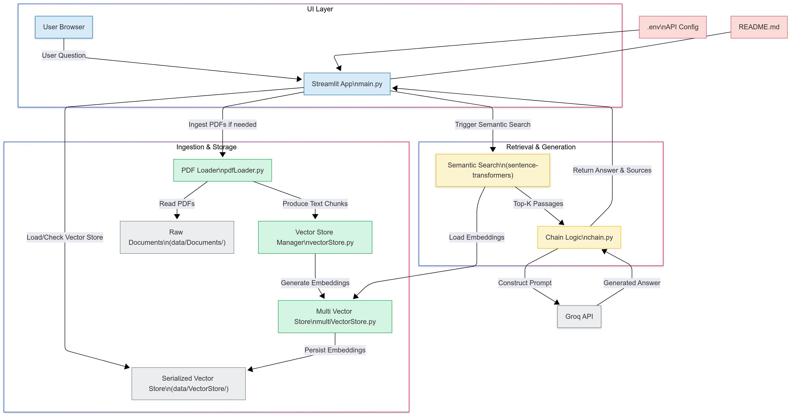

# RAG PDF QA

RAG-PDF-QA is a Streamlit-based application that allows users to ask questions about the content of PDF documents. It leverages vector stores and large language models to provide accurate, reference-backed answers based on the provided documents.

## Features
- **PDF Document Ingestion:** Load and process PDF files from a specified directory.
- **Document Splitting:** Automatically splits PDF pages into overlapping text chunks for improved semantic search and retrieval accuracy.
- **Vector Store Creation:** Embed and store document pages for efficient semantic search.
- **Question Answering:** Ask questions about the ingested documents and receive answers with references to the source document and page.
- **Streamlit UI:** Simple web interface for user interaction.
- **(In Progress) Multi-Document Support:** Backend code for managing and querying multiple PDF documents is present, but not yet integrated into the main UI.

## How it Works
1. **PDF Loading:** All PDF files in `data/Documents/` are loaded and each page is extracted.
2. **Splitting:** Each page is split into overlapping text chunks (default: 1000 characters per chunk, 250 character overlap) using a recursive character splitter. This ensures that answers can be found even if the relevant information spans across page boundaries or is located in the middle of a long page.
3. **Embedding & Vector Store:** The text chunks are embedded and stored in a vector store for fast semantic search.
4. **Question Answering:** When a user asks a question, the app searches the vector store for the most relevant chunks and uses an LLM to generate an answer, citing the source document and page.

## Directory Structure
```
├── app/
│   ├── main.py                # Streamlit app entry point
│   ├── pdfLoader.py           # PDF loading utilities
│   ├── vectorStore.py         # Single vector store management
│   ├── multiVectorStore.py    # Multi-document vector store backend (not yet in UI)
│   ├── chain.py               # LLM chain and prompt logic
├── data/
│   ├── Documents/             # Place your PDF files here
│   │   └── document.txt       # Directory guide ("Put the pdf file in this directory.")
│   ├── VectorStore/           # Stores vector store pickle files
│   │   ├── vector_store.pkl   # Main vector store file
│   │   └── vector_store.txt   # Directory guide ("Vector store will be created in this directory.")
│   └── Diagram/               # Project workflow diagrams
│       ├── diagram-dark.png
│       └── diagram-light.png
├── README.md                  # Project documentation
```

## Diagram

<picture>
  <source srcset="data/Diagram/diagram-dark.png" media="(prefers-color-scheme: dark)">
  <source srcset="data/Diagram/diagram-light.png" media="(prefers-color-scheme: light)">
  
</picture>

## Setup Instructions
1. **Clone the repository:**
   ```bash
   git clone <repo-url>
   cd <repo-directory>
   ```
2. **Install dependencies:**
   Create a `requirements.txt` with the following (or use your preferred environment manager):
   ```
   streamlit
   langchain
   langchain-core
   langchain-community
   langchain-huggingface
   langchain-groq
   python-dotenv
   sentence-transformers
   ```
   Then install:
   ```bash
   pip install -r requirements.txt
   ```
3. **Set up environment variables:**
   - Create a `.env` file in the root or `app/` directory with your [Groq API key](https://console.groq.com/):
     ```
     GROQ_API_KEY=your_groq_api_key_here
     ```
4. **Add PDF documents:**
   - Place your PDF files in `data/Documents/`.

## Usage
1. **Run the Streamlit app:**
   ```bash
   streamlit run app/main.py
   ```
2. **Interact via the web UI:**
   - Enter your question in the input box and click "Submit".
   - The app will search the ingested documents and return an answer with references.

**Note:**
- On first run or when adding new documents, the app will process all PDFs and create/update the vector store. This may take some time depending on the number and size of documents.
- The `data/Documents/document.txt` and `data/VectorStore/vector_store.txt` files are directory guides and can be safely ignored or removed if not needed.

## Multi-Document Support (Backend Only)
- The file `app/multiVectorStore.py` contains backend logic for managing and querying multiple PDF documents, each with its own vector store.
- This feature is **not yet integrated into the main Streamlit UI**. If you wish to experiment, you can use the class directly in your own scripts/notebooks.
- Vector stores for multiple documents are intended to be stored in a dedicated directory (see code for details), but this is not yet active in the main workflow.

## Enhancement

**In Progress**
- Integration of robust support for managing and querying multiple PDF documents simultaneously.

**Planned Enhancements**
- Enable users to upload their own PDF files directly through the web interface.
- Extend document processing capabilities to support a wider range of file formats beyond PDFs.

## Dependencies
- [Streamlit](https://streamlit.io/)
- [LangChain](https://python.langchain.com/)
- [langchain-core](https://pypi.org/project/langchain-core/)
- [langchain-community](https://pypi.org/project/langchain-community/)
- [langchain-huggingface](https://pypi.org/project/langchain-huggingface/)
- [langchain-groq](https://pypi.org/project/langchain-groq/)
- [sentence-transformers](https://www.sbert.net/)
- [python-dotenv](https://pypi.org/project/python-dotenv/)
- [Groq LLM API](https://console.groq.com/)

## Environment Variables
- `GROQ_API_KEY`: Your API key for Groq LLM access (required).

## License
[MIT License](https://github.com/yash-meshram/rag-pdf-qa?tab=MIT-1-ov-file)

## Acknowledgements
- Built with [LangChain](https://python.langchain.com/) and [Streamlit](https://streamlit.io/).
